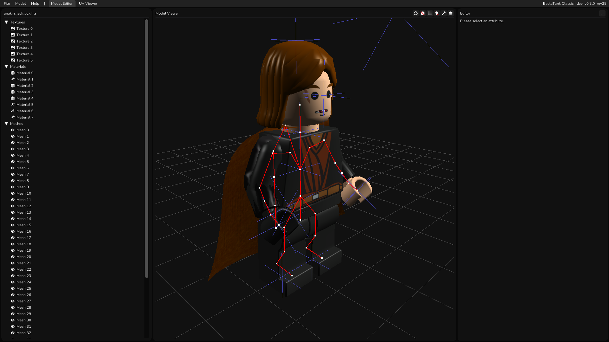

# Program Overview
BactaTank Classic provides a familiar but new UI, updating on the previous version. Let's go over the new UI.

?> This is a general overview of BactaTank Classic and further details will be present on other pages, these will be linked where relevant.

## Welcome Screen
 
Upon opening BactaTank Classic, you will see the welcome screen, which can let you create a new character from a [template](#templates) or by opening an existing `*_PC.GHG` file. Alternatively, you can drag and drop a `*_PC.GHG` file onto the window. After opening a model file you will be greeted by the main UI.

## Environments
BactaTank Classic separates things by "Environments". At the moment there are only two environments, one for the main model editing and one for UV map viewing. More environments are planned to be added in relation to other file format editing.

### Model Editor Environment
 
The model editor environment is where most of the model editing will be taking place. This contains; a panel for the attributes (elements inside the model file like textures and materials), a panel for the model viewing, and a panel for editing the currently selected attribute.

The left panel contains the character attributes, this is where you select the character attribute you want to look at or edit.

The center panel contains the main model viewer, which renders the model as accurately as possible to the game it comes from (it is not perfect, but damn close).

The right panel contains the currently selected attribute's edit panel. Things you can edit or change about that attribute.

### UV Viewer Environment
 
BactaTank Classic now lets you view the UVs that a character has. This can be useful when lining up new textures. Using this you can export out the UV map and use it in an image editor when lining up the textures, it can be very useful.

## Menu Bar
The menu bar contains some useful functions to use when using BactaTank, here is a general overview.

- `File`
  - `New Model` - Opens the template window so you can create a new model.
  - `Open Model` - Opens the Windows open file dialog so you can open a `*_PC.GHG` model file.
  - `Save Model` - Opens the Windows save file dialog so you can save the model you are working on.
  - `Preferences` - Opens the preferences window so you can edit preferences.
  - `Exit` - Quits the program.
- `Model`
  - `Export Armature` - This will export the current characters armature (also known as a skeleton or rig) to a `*.barm` file to be imported in Blender using the BactaTank Classic add-on.
  - `Export Model` - This will export the entire model to a `*.bmodel` file to be imported into Blender using the BactaTank Classic add-on.
  - `Export Model From Preview` - This will export the entire model using the current previewed layers to a `*.bmodel` file to be imported into Blender using the BactaTank Classic add-on.
  - `Export Render` - This will export a render of the viewport with a transparent background.
- `Help`
  - `Documentation` - This will open the documentation in your web browser.
  - `Submit Bug Report` - This will open the GitHub issues page for BactaTank Classic in your web browser.
  - `About` - This will open an about window.

## Templates
Templates are models that you can reuse to make new characters. Many people in the modding community have provided resources and template characters. BactaTank does not come with templates by default, but you can add your own whilst on the welcome screen by hitting , dropping files into that directory and hitting .

?> Only `*_PC.GHG` files will be recognized when detecting template files.