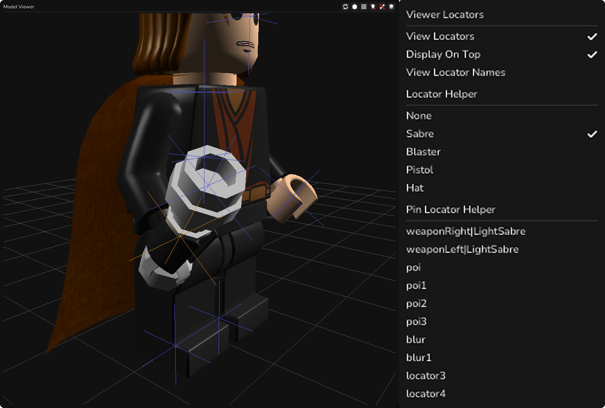

# Model Viewer Overview
 
BactaTank Classic provides a model viewer so you can view the models and judge how they will look in-game. The renderer for this is fairly accurate to the game however it is not perfect.

## Panning and Orbiting the Camera
Panning and orbiting the camera works as expected like in most other 3D programs. Use `Left Mouse` to orbit the camera, `Right Mouse` to pan the camera, `Middle Mouse Scroll` to zoom in and out and you can use `Middle Mouse` to slide the camera in and out too, providing more control.

## Bones
Bones are displayed in the model viewer, these are the white nodes connected by red lines. You can toggle viewing these by clicking  on the top right of the panel. You can right click  to show more options including showing the bone names. You can also use `B` to toggle bone viewing and `Ctrl+B` to toggle bone name viewing.

## Locators
Locators are what the games use to place objects, such as weapons, shadows and accessories. The locators are displayed as blue crosshairs. You can click  to toggle the viewing between in-front, inside, or off. You can also right click  to show more options including a locator helper, which we will get into later. You can also use `L` to toggle locator viewing and `Ctrl+L` to toggle locator name viewing.

## Layers
Layers are what the games use to decide what meshes to render when. These mainly control things like Level of Detail meshes, but can be used in other ways. You can select which layers are viewed in the viewer by clicking  and toggling the layers. You can also use `Ctrl+[1-9]` to toggle layers 0-8 and `Ctrl+Shift+[1-9]` to toggle layers 8-17. You can also hold `Alt` with those other hotkeys to solo that layer.

## Other Options
-  - This button will reset the camera back to the default position. You can also use `R`.
-  - This button will toggle viewing disabled meshes (meshes that have their primitive type set to `None`).
-  - This button will toggle viewing the grid.

## Locator Helper
 
The locator helper is a new addition, allowing you to have a test mesh applied to the locator that you are currently editing. This is useful for lining up locators properly. You can also pin locator helpers to locators for comparing and matching.