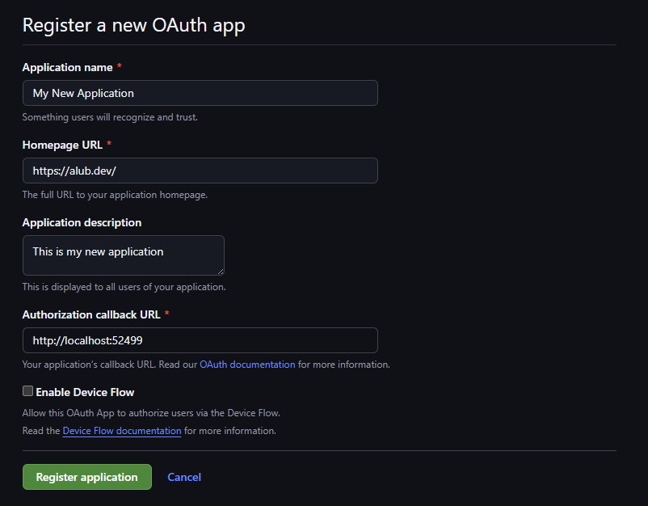

# Authentication
It is quite common to want the user to authenticate themselves so your game can act as them. So alongside regular API authentication tokens, you can also authenticate a user with OAuth. GitHub.gml provides a helper constructor `GitHubOAuth` to help you request user authentication. Before we can check authentication in GameMaker we need to set up an OAuth app.

## Device-Flow Authentication

### Creating an OAuth app
To create an OAuth app, [register a new OAuth app](https://github.com/settings/applications/new) or go to your GitHub developer settings and register one from there. The application needs a name, homepage URL and authorization callback URL to be set. We don't need the URLs to be anything specific for the GameMaker implementation. Make sure to check `Enable Device Flow` as our OAuth app is not a web-app.


Once the application is registered, the only thing you will need is the `Client ID`, so copy that and keep it somewhere safe.

### Requesting Authentication
Back in the GML side, we need to request authentication from a user using this new app. The code below will request authentication from GitHub with a specified [scope](https://docs.github.com/en/apps/oauth-apps/building-oauth-apps/scopes-for-oauth-apps), once the request has become successful it will then display a message in the debug console with a link and code for the user to sign-in. We also create a callback which will be executed when a sign-in is successful as well as start polling the authentication.

?> Only request scopes that you need.

```gml
// Create OAuth
oauth = new GitHubOAuth(_clientID);

// Create auth request
oauthRequest = oauth.requestAuthentication(["repo", "read:user"]);

// Set the request callback
oauthRequest.setCallback(function (_resultBody, _request)
{
	// Check that the request has made it through
	if (_request.httpStatus == 200)
	{
		// Show debug message to login
		show_debug_message($"Please visit: \"{_resultBody.verification_uri}\" and use the code: \"{_resultBody.user_code}\". This code will expire in {_resultBody.expires_in} seconds.");
		
		// Set our authentication callback (runs when authentication is successful)
		oauth.setAuthenticationCallback(function(_resultBody, _request) {
			show_message(_resultBody);
		});
		
		// Now we poll the authentication
		oauth.pollAuthentication(_resultBody.device_code, _resultBody.interval + 1, 20);
	}
});
```

Once authentication has become successful, when a new `GitHub` constructor is created with no token parameter set, it will default to the currently authenticated user. More detailed documentation for `GitHubOAuth` can be found [here](GitHubOAuth).

## Web-Flow Authentication

### Creating an OAuth app
To create an OAuth app, [register a new OAuth app](https://github.com/settings/applications/new) or go to your GitHub developer settings and register one from there. The application needs a name, homepage URL and authorization callback URL to be set. The callback URL must be set to `http://localhost:[configured port]`, where the configured port can be found in `__GitHubConfig`.



Once the application is registered, you will need both the `Client ID` and `Client Secret`, so copy them and keep it somewhere safe.

### Requesting Authentication
Back in the GML side, we need to request authentication from a user using this new app. The code below will request authentication from GitHub with a specified [scope](https://docs.github.com/en/apps/oauth-apps/building-oauth-apps/scopes-for-oauth-apps), once the request has become successful it will then display a message in the debug console.

?> Only request scopes that you need.

```gml
// Create OAuth
oauth = new GitHubOAuth(_clientID, _clientSecret);

// Create a success callback
oauth.setAuthenticationCallback(function (_resultBody, _request))
{
	show_debug_message("Authentication successful!");
}

// Create auth request
oauthRequest = oauth.requestAuthenticationViaWebPage(["repo", "read:user"]);
```

When authentication is requested via a web page, the browser will open to prompt the user to log into GitHub. After logging in, the browser will redirect to `http://localhost:[configured port]` and provide GitHub.gml a valid authentication token. You may want to implement a success and error callbacks which will execute upon a request. Please see [`GitHubOAuth.setAuthenticationCallback`](GitHubOAuth#setauthenticationcallback) or [`GitHubOAuth.setAuthenticationErrorback`](GitHubOAuth#setauthenticationerrorback) for more information.